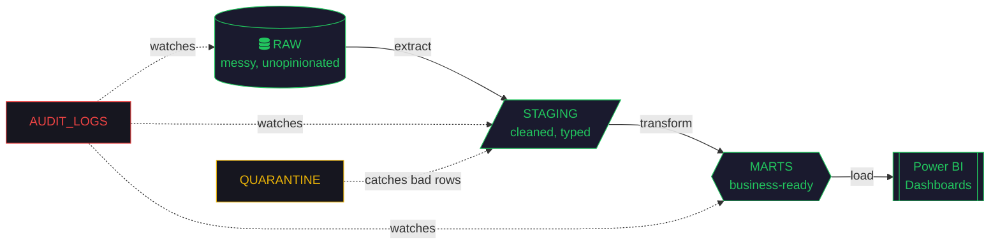

<div align="center">

```
┌─────────────────────────────────────────────────────────────┐
│  $ airflow dags trigger emmanuel_leakono_v2                 │
│  [2026-08-11 09:41:03] INFO - DAG triggered successfully     │
│  [2026-08-11 09:41:03] INFO - Scheduler: it's_a_me_engine    │
└─────────────────────────────────────────────────────────────┘
```


</div>

<br>

<table align="center">
<tr>
<td>

```python
# about_me.py
class Engineer:
    def __init__(self):
        self.name          = "Emmanuel Leakono"
        self.base          = "Nairobi, Kenya"
        self.role          = ["Data Engineer", "Software Engineer"]
        self.origin_story  = "started with zero laptop experience"
        self.trained_at    = ["Moringa School", "PLP Academy"]
        self.philosophy    = "ask why, not just how"

    def debug(self, problem: str) -> str:
        # I don't stop at "it works now" —
        # I stop at "I understand why it broke"
        return self.philosophy

if __name__ == "__main__":
    me = Engineer()
    print(me.debug("silently paused DAG at 2am"))
    # >>> ask why, not just how
```

</td>
</tr>
</table>

<br>

## `⛁` pipeline architecture



*That's not a metaphor — that's the actual six-schema Snowflake layout I run in production-style projects.*

<br>

## `⛁` tech stack — `requirements.txt`

<table align="center">
<tr>
<td valign="top" width="50%">

**// data engineering**
```
python        # main tool
sql           # main language i think in
dbt           # transformation layer
apache-airflow # orchestration, standalone venv
snowflake     # warehouse
postgresql    # source systems
power-bi      # the part people actually see
```

</td>
<td valign="top" width="50%">

**// software engineering**
```
javascript / typescript
react
node.js + express
django / flask
mongodb / mysql
git + linux + postman
```

</td>
</tr>
</table>

<br>

## `⛁` `$ tail -f build_log.txt`

```diff
+ [PASS] flight_operations_analytics    9-phase pipeline · Power BI published
+ [PASS] books_data_pipeline            scrape → snowflake → dbt → airflow → metabase
+ [PASS] kenya_economic_intelligence    docker · celery · rabbitmq · 3 workers
+ [PASS] retail_analytics_pipeline      airflow · star schema · power bi
+ [PASS] crypto_market_pipeline         foundational end-to-end build
! [WARN] docker_hardware_constraints    resolved → standalone airflow venv
+ [FIXED] silently_paused_dag           root-caused, not just restarted
+ [FIXED] api_rate_limiting             exponential backoff + airflow pool
i [NEXT]  uber_trip_analytics           nyc tlc dataset — in progress
```

<br>

## `⛁` featured pipelines & builds

<table align="center">
<tr>
<th>project</th>
<th>what it does</th>
<th>stack</th>
</tr>
<tr>
<td><b>Flight Operations Analytics</b></td>
<td>End-to-end platform, all 9 phases from requirements to a published dashboard. Idempotent delete-then-insert loads on a deterministic <code>batch_id</code>.</td>
<td>Python · dbt · Snowflake · Airflow · Power BI</td>
</tr>
<tr>
<td><b>Books Data Pipeline</b></td>
<td>Full modern-data-stack build: scrape → warehouse → transform → orchestrate → visualize.</td>
<td>Python · Snowflake · dbt · Airflow · Metabase</td>
</tr>
<tr>
<td><b>Kenya Economic Intelligence</b></td>
<td>Distributed Airflow setup with Celery + RabbitMQ workers; debugged real production-style failures, not toy bugs.</td>
<td>Docker Compose · CeleryExecutor · RabbitMQ · PostgreSQL</td>
</tr>
<tr>
<td><a href="https://github.com/LEAKONO/task-master-frontend"><b>Task Manager App</b></a></td>
<td>Full-stack productivity app.</td>
<td>React · Express</td>
</tr>
<tr>
<td><a href="https://github.com/LEAKONO/Budget-Trucker"><b>Personal Finance Tracker</b></a></td>
<td>Budgets and savings management.</td>
<td>MERN</td>
</tr>
</table>

<sub>→ add repo links for the data pipeline builds above once they're live and this table writes itself.</sub>

<br>

## `⛁` monitoring dashboard

<div align="center">


</div>

<div align="center">

</div>

<br>

## `⛁` `$ whoami --verbose`

```
> not from a CS background. not from money. not from an easy start.
> taught myself with a borrowed laptop and a stubborn need to know why,
> not just how. every pipeline in this profile is proof of that —
> broken DAGs debugged at 2am, API rate limits fought and won,
> six-schema warehouses built because "it works" wasn't good enough.
> still learning. still shipping. still asking why.
```

<br>

<div align="center">

**`⛁` connect**

[](mailto:leakonoemmanuel3@gmail.com)
[](https://www.linkedin.com/in/emmanuel-leakono-7125472b8/)
[](https://leakono-portfolio.vercel.app/)

<sub>pipeline status: <b>🟢 running</b> · last dag run: today</sub>

</div>
