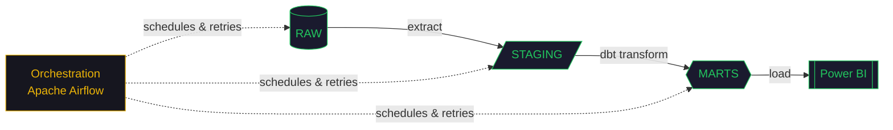

<div align="center">

```text
$ ./initialize_engineer.sh

Loading engineer profile...

identity     → Emmanuel Leakono
role         → Data Engineer
location     → Nairobi, Kenya 🇰🇪
specialty    → Data Pipelines & Analytics

initializing stack...

python       → [████████████████████] READY
sql          → [████████████████████] READY
snowflake    → [████████████████████] READY
dbt          → [████████████████████] READY
airflow      → [████████████████████] READY
power-bi     → [████████████████████] READY

────────────────────────────────────────────
SYSTEM STATUS   : 🟢 ONLINE
PIPELINE STATUS : 🟢 RUNNING
────────────────────────────────────────────
```


</div>

<br>

<table align="center">
<tr>
<td valign="top">

```text
        ┌────────────────────────┐
        │   E M M A N U E L      │
        │      L E A K O N O     │
        ├────────────────────────┤
        │  ▓▓▓▓▓▓▓▓▓▓▓▓▓▓▓▓▓▓▓▓  │  ← marts   (bi-ready)
        │  ▓▓▓▓▓▓▓▓▓▓▓▓▓▓▓▓▓▓▓▓  │  ← staging (typed)
        │  ▓▓▓▓▓▓▓▓▓▓▓▓▓▓▓▓▓▓▓▓  │  ← raw     (ingested)
        ├────────────────────────┤
        │   >_ data engineer     │
        └────────────────────────┘
               ▓▓▓▓▓▓▓▓▓▓
              ▓▓▓▓▓▓▓▓▓▓▓▓
             ▓▓▓▓▓▓▓▓▓▓▓▓▓▓
```

</td>
<td valign="top">

```text
emmanuel@nairobi
-----------------
OS ..........  Data Engineer
Host ........  Nairobi, Kenya
Kernel ......  learn → build → ship
Uptime ......  2+ years, backend & data systems
Shell .......  bash / zsh (linux)
Editor ......  VS Code

Lang ........  Python, SQL
Cloud .......  AWS
Storage .....  Amazon S3
Warehouse ...  Snowflake
Transform ...  dbt
Orchestrate .  Apache Airflow
Analytics ...  Power BI

Contact.Mail   leakonoemmanuel3@gmail.com
Contact.Hub .  github.com/LEAKONO
Contact.In ..  /in/emmanuel-leakono-7125472b8

-----------------
STATUS .......  BUILDING
MODE .........  SHIPPING
FOCUS ........  DATA ENGINEERING
```

</td>
</tr>
</table>

<br>

## `⛁` pipeline architecture



<br>

## `⛁` tech stack — `requirements.txt`

<table align="center">
<tr>
<td valign="top" width="50%">

**// data engineering**
```text
python
sql             # window functions, CTEs
snowflake
postgresql / mysql
dbt             # certified: Fundamentals
apache-airflow  # certified: Essentials
aws
power-bi
docker + github-actions
```

</td>
<td valign="top" width="50%">

**// software engineering**
```text
javascript (es6+) / typescript
react + redux + tailwind
django + drf / flask
node.js + express
jwt / oauth2 / bcrypt
git + linux + postman
```

</td>
</tr>
</table>

<br>

## `⛁` `$ tail -f build_log.txt`

```diff
+ [PASS] flight-ops-analytics-platform   watermark incremental loads → 70% faster runtime
+ [PASS] retail_pipeline                 1M+ transactions → star schema + dbt quality tests
+ [PASS] uber-trip-analytics-platform    10K+ simulated daily trips, incremental pipelines
+ [DONE] safaridesk_internship           react/typescript frontend + django/postgres apis
```

```text
watermark incremental loading — relative runtime
before  ██████████████████████████████  100%
after   █████████                        30%
```

<br>

## `⛁` `$ whoami --verbose`

```text
> built three production-style data pipelines end to end —
> ingestion, warehousing, transformation, orchestration, and BI —
> plus a backend internship shipping real features on a deadline.
> building reliable systems. shipping continuously.
```

<br>

## `⛁` currently loading...

```text
AWS Cloud Practitioner   [██████████░░░░░░░░░░]  IN PROGRESS
```

```python
next_targets = [
    "Kafka & event streaming",
    "Distributed data systems",
    "Advanced warehouse architecture",
    "Cloud architecture patterns",
    "Advanced SQL",
]
```

<br>

## `⛁` `$ cat engineering_principles.txt`

```text
reliable      → pipelines should recover
observable    → failures should be visible
reproducible  → transformations should be deterministic
scalable      → design for the next 100×
useful        → data should drive decisions
```

<br>

<div align="center">

**`⛁` connect**

[](mailto:leakonoemmanuel3@gmail.com)
[](https://www.linkedin.com/in/emmanuel-leakono-7125472b8/)
[](https://leakono-portfolio.vercel.app/)

<sub>building data systems · Nairobi, Kenya 🇰🇪 · available for opportunities</sub>

</div>
